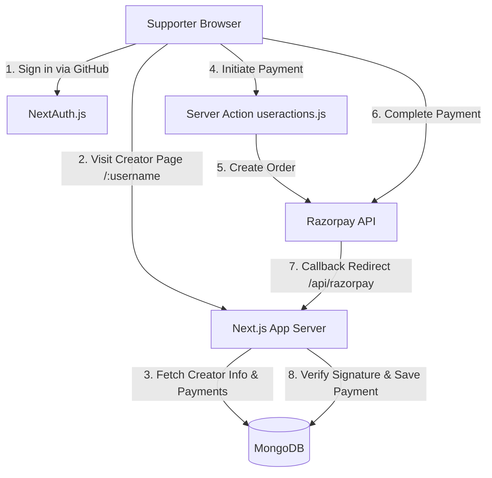

# ☕ Get Me a Chai — Crowdfunding Platform for Creators

> A modern, full-stack micro-crowdfunding platform inspired by *Buy Me a Coffee*, enabling content creators, open-source developers, and artists to receive direct payments ("Chais") from their supporters.

---

## 📌 Table of Contents
- [Project Overview](#-project-overview)
- [Problem Solved](#-problem-solved)
- [Live Demo & Repository Links](#-live-demo--repository-links)
- [Key Features](#-key-features)
- [Tech Stack](#-tech-stack)
- [System Architecture](#-system-architecture)
- [Directory Structure](#-directory-structure)
- [Local Installation & Running](#-local-installation--running)
- [Environment Variables](#-environment-variables)
- [License](#-license)

---

## ☕ Project Overview

**Get Me a Chai** is a creator-first funding platform that simplifies micro-donations. Supporters can quickly make payments, leave custom messages, and show appreciation to their favorite creators. Creators receive funds directly into their connected Razorpay accounts.

---

## 💡 Problem Solved

Traditional monetization methods for indie creators (sponsorships, ads, affiliate links) often have high entry barriers, strict payment thresholds, or complex setups.

**Get Me a Chai** addresses these issues by providing:
1. **Direct Fan Support**: Micro-transactions directly from fans with personalized messages.
2. **Zero Middleman Delays**: Creators link their own Razorpay credentials so payments settle directly to them.
3. **Public Recognition**: Supporters are listed on creator leaderboards with support amounts and messages.
4. **Frictionless Onboarding**: Single-click GitHub OAuth sign-in and straightforward dashboard setup.

---

## 🔗 Live Demo & Repository Links

- **Live Site**: [https://get-me-a-chai.vercel.app](https://get-me-a-chai.vercel.app)
- **GitHub Repository**: [SahilAdvani/get-me-a-chai](https://github.com/SahilAdvani/get-me-a-chai)

---

## ✨ Key Features

- 🔐 **GitHub OAuth Authentication**: Fast and secure authentication using `next-auth`.
- 🎨 **Customizable Creator Profiles**: Public routes (`/[username]`) with custom avatars, cover photos, bio, and donor lists.
- ⚙️ **Personalized Creator Dashboard**: Creators configure their username, profile details, and individual Razorpay Key ID and Secret.
- 💳 **Razorpay Payment Gateway Integration**: Generates orders and verifies signature authentications (`validatePaymentVerification`) server-side.
- 🏆 **Supporters Leaderboard & Feed**: Real-time display of top contributors and message logs on profile pages.
- 📱 **Responsive Dark-Theme UI**: High-contrast, modern UI built with Tailwind CSS v4 and custom radial gradients.

---

## 🛠 Tech Stack

- **Framework**: Next.js 16 (App Router) & React 19
- **Styling**: Tailwind CSS v4
- **Authentication**: NextAuth.js (GitHub Provider)
- **Database**: MongoDB & Mongoose ORM
- **Payments**: Razorpay SDK
- **Notifications**: React Toastify

---

## 🏗 System Architecture



---

## 📁 Directory Structure

```
get-me-a-chai/
├── actions/             # Server actions (useractions.js)
├── app/                 # Next.js App Router (pages, layouts, api routes)
├── components/          # React UI components (Navbar, Footer, PaymentPage, Dashboard)
├── db/                  # Database connection (connectDb.js)
├── models/              # Mongoose models (User.js, Payment.js)
├── public/              # Static assets, robots.txt, sitemap.xml
└── .env.example         # Environment variables template
```

---

## 🚀 Local Installation & Running

### Prerequisites
- Node.js (v18.x or higher)
- Create a MongoDB cluster (using MongoDB Atlas or local MongoDB / MongoDB Compass) and obtain your DB URI.
- GitHub Developer Account (for OAuth credentials).

### Steps

1. **Clone the repository**
   ```bash
   git clone https://github.com/SahilAdvani/get-me-a-chai.git
   cd get-me-a-chai
   ```

2. **Install dependencies**
   ```bash
   npm install
   ```

3. **Configure Environment Variables**
   Create a `.env.local` file in the root directory:
   ```bash
   cp .env.example .env.local
   ```
   Add your MongoDB connection string and GitHub OAuth credentials.

4. **Run the development server**
   ```bash
   npm run dev
   ```

5. Open [http://localhost:3000](http://localhost:3000) in your browser.

---

## 🔑 Environment Variables

```env
NEXTAUTH_URL=http://localhost:3000
NEXTAUTH_SECRET=your_nextauth_secret
GITHUB_ID=your_github_client_id
GITHUB_SECRET=your_github_client_secret
MONGODB_URI=your_mongodb_connection_string
NEXT_PUBLIC_URL=http://localhost:3000
```

---

## 📄 License

[MIT License](LICENSE)
